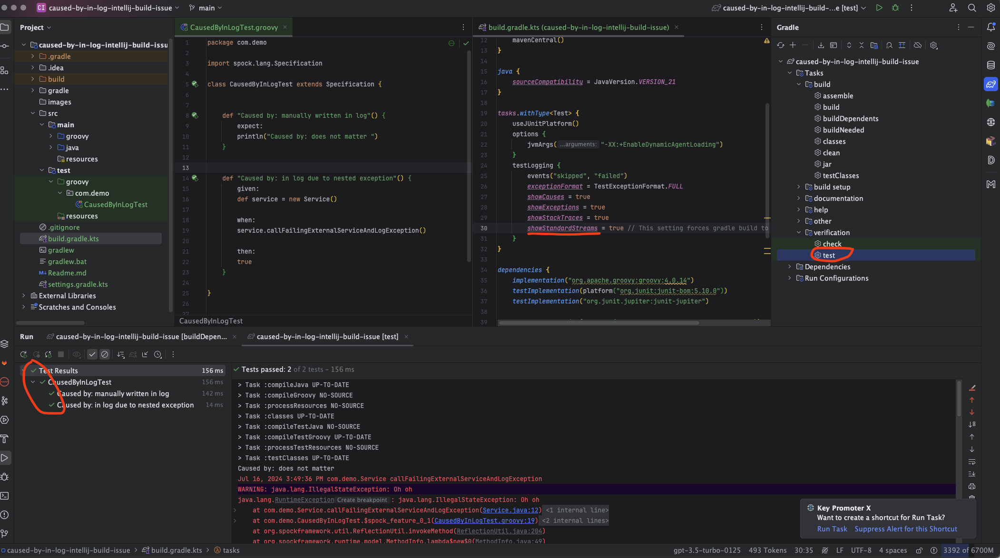
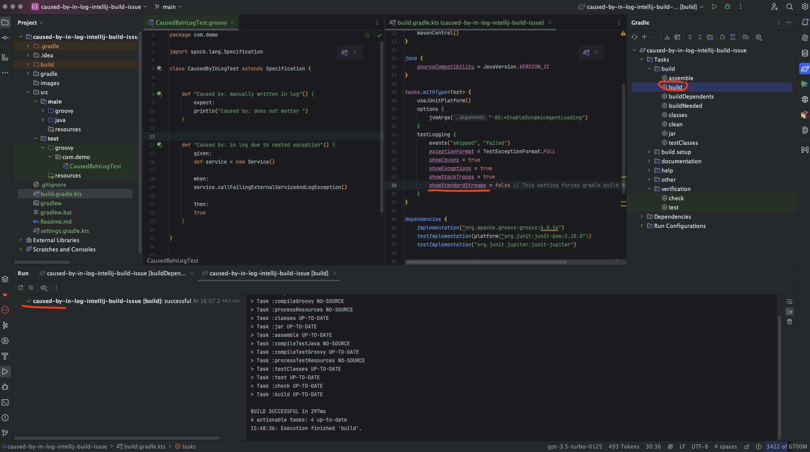
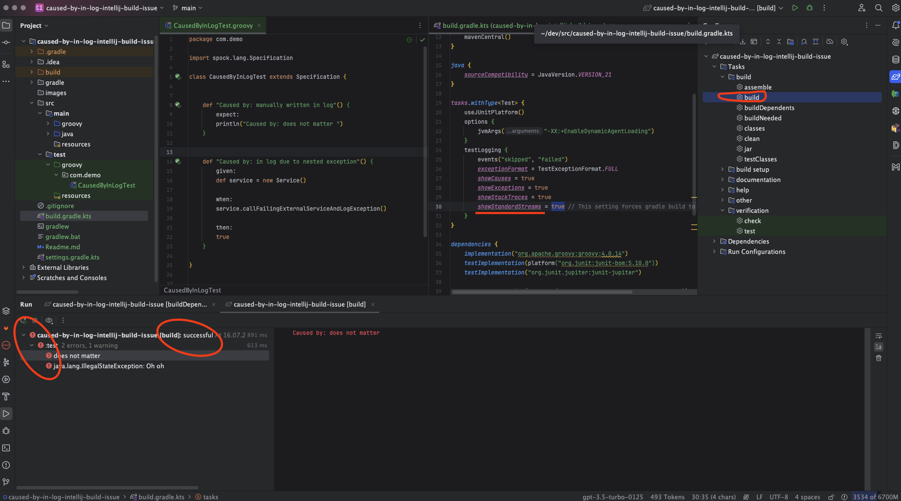

# Sample project to tackle Intellij gradle build ui issue if 
### Preconditions:
- Gradle TestLogging is configured with `showStandardStreams=true`
- A class under test logs a nested exception like e.g. Spring JPA repository if database is not present.
- Spock test expects exception and thus runs successful

### Result:
- Running such tests from IntelliJ with gradle or via Gradle tool window with `test` target works fine.
 
     
---
- Running such tests from Gradle tool window with `build` target and  `showStandardStreams=false`in build.gradle.kts works fine.
 

---
- Running such tests from Gradle tool window with `build` target and  `showStandardStreams=true`in build.gradle.kts shows errors in gradle build view although the build is successful.
   
---

### Assumption:
**Caused by:** is somehow parsed from the logs and handled as error
